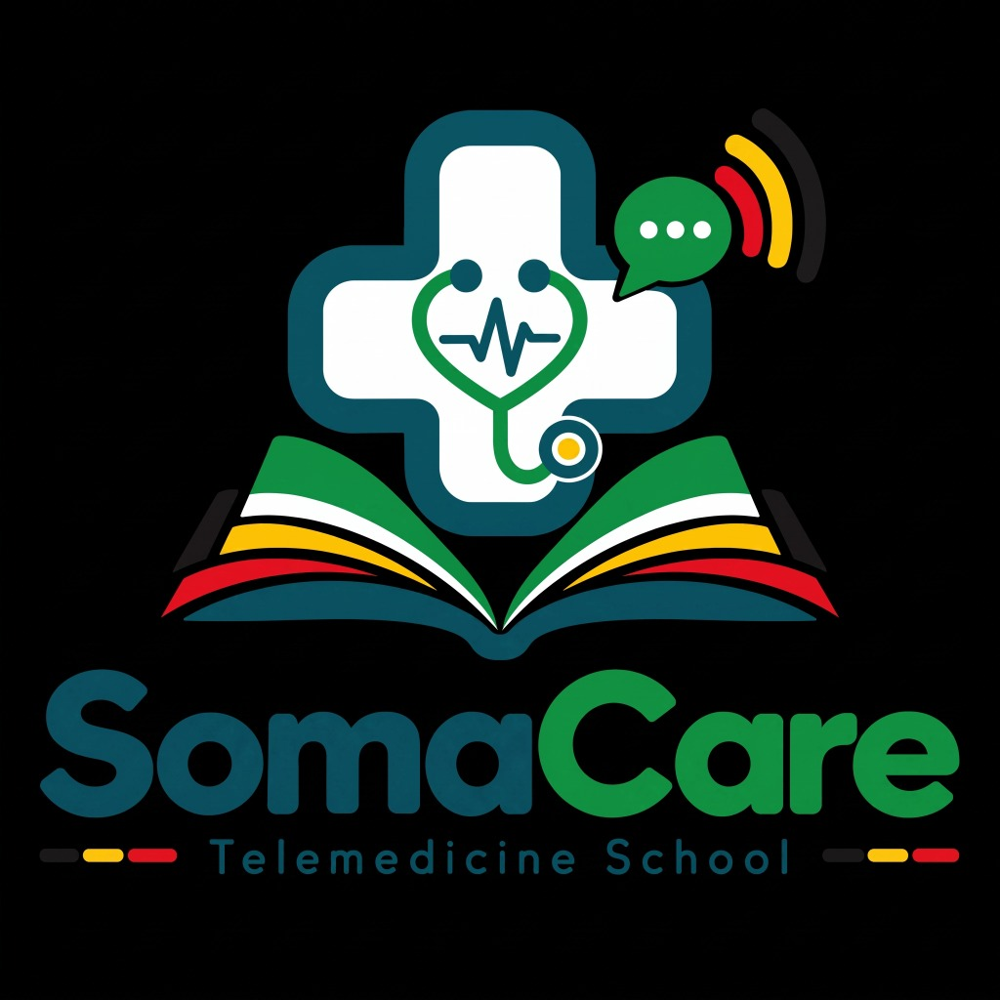

<p align="center">
  
</p>

<h1 align="center">SomaCare™ Telemedicine Platform</h1>

<p align="center">
  <strong>Next-Generation Campus Telemedicine & Digital Healthcare Ecosystem</strong>
</p>

<p align="center">
  
  
  
  
  
  
</p>

---

## 🏥 Executive Overview

**SomaCare** is an enterprise-grade campus telemedicine operating system designed for universities, colleges, and higher education institutions. It seamlessly connects students with certified healthcare providers, emergency response networks, on-campus clinics, and pharmacy dispensaries.

The platform provides a unified digital care continuum: from real-time HD video consultations and AI triage to live prescription management, encrypted health records, emergency dispatch, and an integrated campus medical store.

---

## 🌟 Core System Highlights

```
                          ┌───────────────────────────┐
                          │   SomaCare Unified Core   │
                          │   (PostgreSQL + Realtime) │
                          └─────────────┬─────────────┘
                                        │
        ┌───────────────────────────────┼───────────────────────────────┐
        │                               │                               │
 📱 Student App                  🩺 Doctor Portal               🏛️ Admin Dashboards
 • Virtual Consultations         • Patient Schedule             • School Dashboard
 • AI Symptom Triage             • Live Agora Video Room        • Hospital Network Hub
 • Digital Prescriptions         • E-Prescribing & Refills      • Super Admin Governance
 • Emergency SOS Dispatch        • Lab Results Diagnostic       • Tenant Orchestration
 • Campus Medical Store          • Realtime Notifications       • Multi-Tenant RBAC
```

---

## ✨ Feature Matrix

### 1. 🎓 Student Experience App
- **Live Video Consultations**: Low-latency, encrypted telehealth powered by **Agora RTC Engine**.
- **AI-Powered Symptom Checker**: Instant triage and clinical guidance powered by LLM inference.
- **24/7 Urgent Care & SOS Dispatch**: One-tap emergency alert routing directly to campus health centers and on-call physicians.
- **Comprehensive Medical History**: Encrypted timeline of chronic conditions, immunizations, allergies, and surgical histories.
- **Smart Medication Reminders**: Schedule tracking, dosage alerts, and adherence logging.
- **Campus Medical Store**: In-app digital pharmacy catalog with prescription-required validation, cart checkout, and order history.
- **Direct Doctor Messaging**: Realtime encrypted messaging with voice notes and image attachments.

### 2. 🩺 Physician Workspace
- **Dynamic Daily Schedule**: Real-time queue for scheduled, pending, and urgent student consultations.
- **Consultation Waiting Room**: Video control hub with clinical note-taking and diagnosis entry during active calls.
- **Digital Prescription Pad**: Issue authenticated e-prescriptions directly linked to student profiles.
- **Lab Diagnostic Hub**: Review, enter, and approve student lab tests with automatic abnormal/critical value flags.
- **Emergency Queue**: Dedicated high-priority alert system for students requesting immediate intervention.

### 3. 🏛️ Institutional Governance & Dashboards
- **School Health Dashboard**: Campus-level analytics, student population health trends, and health staff management.
- **Hospital Network Dashboard**: Inter-hospital triage, bed availability, ambulance tracking, and doctor dispatch.
- **Super Admin Governance Vault**: Enterprise multi-tenancy, custom role generator, and immutable security audit logs.

---

## 🛠️ Technology Stack

| Layer | Technology | Purpose |
|---|---|---|
| **Mobile & Web Client** | **Flutter 3.x / Dart 3.x** | Cross-platform native application (Android, iOS, Web, Desktop) |
| **State Management** | **Flutter Riverpod** | Reactive, compile-safe dependency injection and state handling |
| **Navigation & Routing**| **GoRouter** | Declarative deep-linking with strict role-based route guards |
| **Backend & Database** | **Supabase (PostgreSQL 15)** | Row-Level-Security (RLS), Realtime replication, and Auth |
| **Realtime Video/Audio**| **Agora RTC SDK** | Low-latency, short-lived token secured WebRTC consultations |
| **AI Triage Engine** | **Groq / Llama 3 Inference** | High-throughput AI symptom screening and clinical analysis |
| **Document Generation** | **PDF / Printing SDK** | Cryptographically verifiable medical history and prescription exports |
| **Admin Dashboards** | **React 18 / TypeScript / Vite** | Web-based institutional portals with Tailwind CSS |

---

## 🔐 Security & Architecture Principles

- **Row Level Security (RLS)**: Fine-grained PostgreSQL policies ensuring strict isolation between tenants, students, and doctors.
- **Zero-Trust Access**: Cryptographic verification on every consultation token with short-lived RTC credentials.
- **Audit Vault**: Comprehensive logging of sensitive medical record access, approval workflows, and administrative actions.
- **HIPAA/GDPR Ready Design**: Patient health information (PHI) is isolated and access-controlled at the database engine level.

---

## 🚀 Getting Started (Development)

### Prerequisites
- Flutter SDK `^3.11.0` or later
- Dart SDK `^3.11.0`
- Android Studio / Xcode
- Supabase Project URL & Anon Key

### Installation

1. **Clone the repository**:
   ```bash
   git clone https://github.com/0Elfaki/Somacare.git
   cd Somacare
   ```

2. **Install dependencies**:
   ```bash
   flutter pub get
   ```

3. **Run the application**:
   ```bash
   flutter run
   ```

4. **Production Build Parameters**:
   ```bash
   flutter run \
     --dart-define=SUPABASE_URL=https://your-project.supabase.co \
     --dart-define=SUPABASE_ANON_KEY=your-anon-key \
     --dart-define=AGORA_APP_ID=your-agora-app-id
   ```

---

## 🧪 Quality Assurance & Testing

```bash
# Static analysis (strict mode)
flutter analyze

# Design system, type scale & widget unit tests
flutter test

# Code formatting compliance
dart format --output=none --set-exit-if-changed lib test
```

---

## 📁 Repository Structure

```
lib/
├── core/
│   └── routing/                  # GoRouter configuration & role guards
├── theme/
│   └── app_theme.dart            # SomaCare Medical Design System tokens
├── widgets/
│   ├── app_ui.dart               # Shared design system components
│   └── bloom_components.dart     # UI elements & controls
└── features/
    ├── auth/                     # Authentication, school selection & onboarding
    ├── student/                  # Student dashboards, bookings, pharmacy, store
    └── doctor/                   # Doctor schedules, consultations, lab diagnostics
```

---

## ⚖️ License & Copyright

**Copyright (c) 2026 Megdad Elfaki / SomaCare. All Rights Reserved.**

This repository and its source code are **Proprietary and Confidential**. Source code is made available for viewing and reference purposes only. Unauthorized copying, cloning, modifying, sublicensing, reverse-engineering, distribution, or commercial exploitation of any part of this software is strictly prohibited under international copyright law.

For licensing inquiries or enterprise partnership requests:
📧 Contact: **megdad.elfaki@gmail.com**
